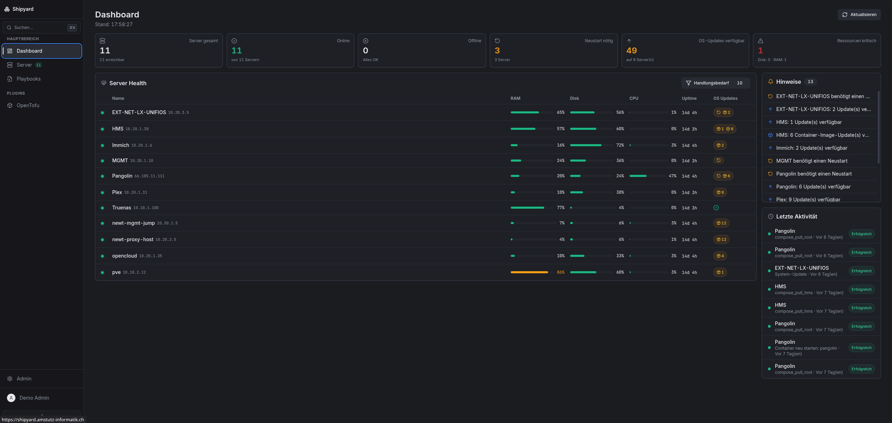
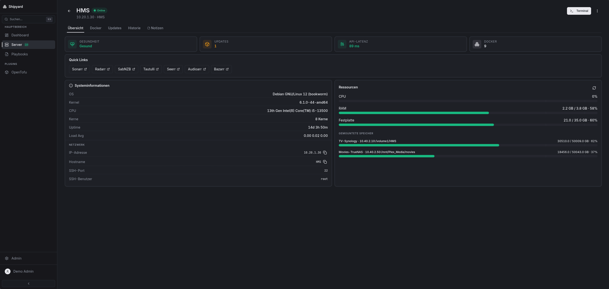
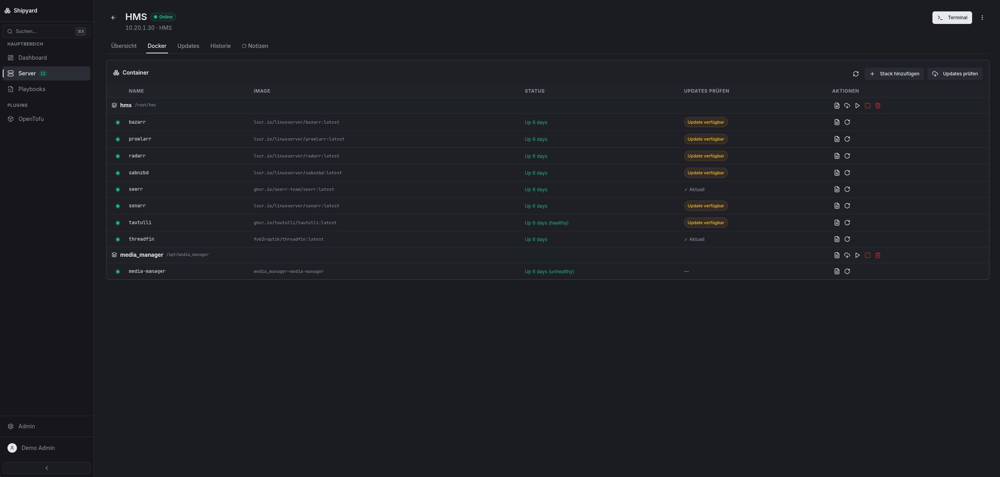
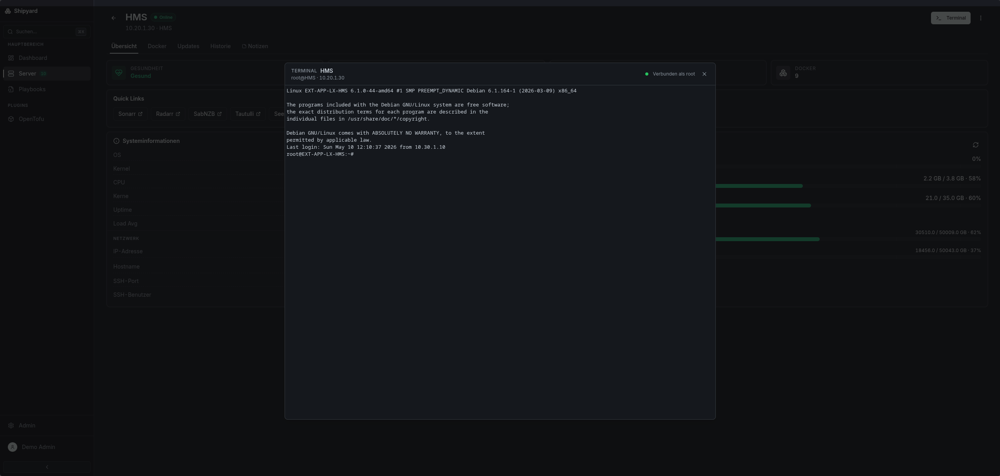
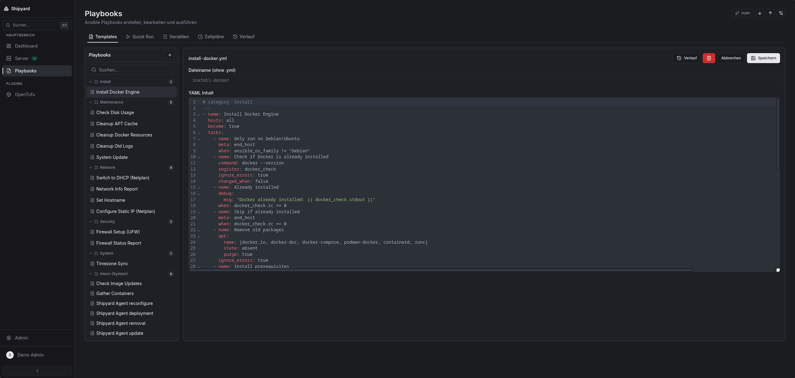

# Shipyard

Web dashboard for managing Linux servers — SSH, system monitoring, OS updates, Docker, and Ansible playbooks in a single interface.

> **Do not expose Shipyard to the public internet.**
> It stores SSH private keys and has direct shell access to all managed servers.
> Run it inside a private network or VPN. See the [Security Guide](https://github.com/tobayashi-san/Shipyard/wiki/Security-Guide).

## Quick Start

```bash
mkdir shipyard && cd shipyard

# Generate secrets
echo "JWT_SECRET=$(openssl rand -hex 32)" > .env
echo "SHIPYARD_KEY_SECRET=$(openssl rand -hex 32)" >> .env

# Create docker-compose.yml
cat > docker-compose.yml << 'EOF'
services:
  shipyard:
    # "latest" points to stable releases only (no RC tags)
    image: ghcr.io/tobayashi-san/shipyard:latest
    container_name: shipyard
    restart: unless-stopped
    ports:
      - "443:443"
    volumes:
      - shipyard-data:/app/server/data
      - ./playbooks:/app/server/playbooks
      - ./plugins:/app/plugins
    environment:
      - NODE_ENV=production
      - JWT_SECRET=${JWT_SECRET:?Create a .env file with JWT_SECRET — see README}
      - SHIPYARD_KEY_SECRET=${SHIPYARD_KEY_SECRET:?Create a .env file with SHIPYARD_KEY_SECRET — see README}
      # Set to 1 when running behind a reverse proxy that sends X-Forwarded-* headers
      # - TRUST_PROXY=1

volumes:
  shipyard-data:
EOF

docker compose up -d
```

Open **`https://<host-ip>`** in your browser. The setup wizard will guide you through account creation, appearance settings, and SSH key generation.
The setup wizard appears only when no users exist; otherwise you will see the login page.

HTTPS is enabled by default with a self-signed certificate — accept the browser warning once, or [bring your own certificate](https://github.com/tobayashi-san/Shipyard/wiki/Installation#custom-tls-certificate).

## Update

```bash
docker compose pull
docker compose up -d
```

With `:latest`, this updates Shipyard to the newest **stable** release.
Release candidates are published as explicit tags (for example `:1.0.2-rc.20`) and do not move `latest`.

## Documentation

**[Wiki](https://github.com/tobayashi-san/Shipyard/wiki)** — [Installation](https://github.com/tobayashi-san/Shipyard/wiki/Installation) · [Configuration](https://github.com/tobayashi-san/Shipyard/wiki/Configuration) · [Security Guide](https://github.com/tobayashi-san/Shipyard/wiki/Security-Guide) · [Server Management](https://github.com/tobayashi-san/Shipyard/wiki/Server-Management) · [Playbooks & Schedules](https://github.com/tobayashi-san/Shipyard/wiki/Playbooks-and-Schedules) · [Docker Management](https://github.com/tobayashi-san/Shipyard/wiki/Docker-Management) · [Plugin System](https://github.com/tobayashi-san/Shipyard/wiki/Plugin-System) · [API Reference](https://github.com/tobayashi-san/Shipyard/wiki/API-Reference) · [Troubleshooting](https://github.com/tobayashi-san/Shipyard/wiki/Troubleshooting)

## Screenshots



<details>
<summary>More screenshots</summary>






</details>

## Features

- **Servers** — add, edit, group, bulk import/export (JSON or CSV)
- **Monitoring** — CPU, RAM, disk, uptime, load average via SSH polling or directly from the Shipyard Agent
- **OS Updates** — via Ansible (`apt`, `dnf`, `pacman`, …) with live terminal output
- **Custom Update Tasks** — track scripts or GitHub releases, shows current vs. latest
- **Docker & Compose** — container overview, logs, restart, edit and run Compose stacks
- **Ansible** — built-in YAML editor, version history, cron scheduler, live output
- **SSH Terminal** — browser-based, resizable, ANSI-aware
- **SSH Key Management** — auto-generate Ed25519, deploy via UI, AES-256-GCM encryption at rest
- **Notifications** — webhooks (Discord, Slack) and SMTP email alerts
- **Auth & Security** — JWT, RBAC with custom roles, TOTP/2FA, audit log, rate limiting, HTTPS
- **Plugins** — hot-reloadable; bundled: OpenTofu / Terraform workspace manager
- **UI** — German & English, light/dark/auto theme, white-label support

## Development

```bash
npm install
npm run dev
```

Starts the backend on port `3001` and the Vite dev server on port `5173` simultaneously.

```bash
# Run backend tests
cd server && node --test
```

## Architecture

```
Browser
  │
  │  HTTPS / WebSocket
  ▼
┌──────────────────────────────────────────┐
│  Node.js + Express                       │
│                                          │
│  REST API     ──►  SQLite (better-       │
│                    sqlite3, WAL mode)    │
│  WebSocket    ──►  live terminal output  │
│  Ansible Runner  ──►  ansible-playbook   │
│  SSH Manager  ──►  node-ssh / ssh2       │
│  System Poller   ──►  SSH commands       │
│  Agent Ingest    ──►  runner metrics     │
│  Scheduler    ──►  node-cron             │
│  Plugin Loader   ──►  /app/plugins/      │
└──────────────────────────────────────────┘
       │ SSH               │ SSH
       ▼                   ▼
  Server A …           Server B …
```
